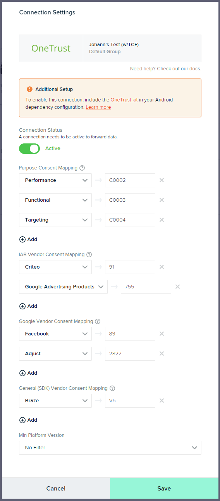

# OneTrust Kit Manual Test Procedure
## Environments
### mParticle Environment
Has a number of purposes configured and, in the connection to the OneTrust output has them mapped to the different categories/purposes and vendors (of all types) in OneTrusts, that are listed in our UI as:

 - Purpose Consent mapping
 - IAB Vendor Consent Mapping
 - Google Vendor Consent Mapping
 - General (SDK) Vendor Consent Mapping

##### Sample Configuration

### OneTrust Environment
Has a IAB TCF 2.2 template with a number of purposes and vendors assigned to the application.

Those would be mapped to the mParticle purposes as explained above.

### Testing Process
The kit should be manually tested by following this process:

1. Connect a test application to a testing environment that has been configured as per above in both mParticle and OneTrust.
1. Start the application.
1. Get the OneTrust banner or preference centre centre to show.
1. Accept all purposes and vendors.
1. Ensure a batch is sent from the application i.e. by triggering an event.
1. Verify:
   - In the user profile at mParticle, that you can see via Activity > User Activity > [Search the profile] > Information tab, under "Consent and Compliance", all purposes should be consented (Look under "Consented" column, where all configured purposes should have `true`).
1. Get the OneTrust banner or preference centre centre to show.
1. Reject all purposes and vendors.
1. Ensure a batch is sent from the application i.e. by triggering an event.
1. Verify:
   - In the user profile at mParticle, that you can see via Activity > User Activity > [Search the profile] > Information tab, under "Consent and Compliance", all purposes should be not consented (Look under "Consented" column, where all configured purposes should have `false`).
1. Get the OneTrust banner or preference centre centre to show.
1. Alternate accepting and rejecting purposes and vendors e.g. accept the first, reject the second, accept the third, reject the fourth, etc.
1. Ensure a batch is sent from the application i.e. by triggering an event.
1. Verify:
   - In the user profile at mParticle, that you can see via Activity > User Activity > [Search the profile] > Information tab, under "Consent and Compliance", ensure that all purposes consent state match those set in OneTrust banner or preference centre.
1. Get the OneTrust banner or preference centre centre to show.
1. Toggle the consent state set previously i.e. reject where accepted and accept where rejected.
1. Ensure a batch is sent from the application i.e. by triggering an event.
1. Verify:
   - In the user profile at mParticle, that you can see via Activity > User Activity > [Search the profile] > Information tab, under "Consent and Compliance", ensure that all purposes consent state match those set in OneTrust banner or preference centre.

The testing is successfull if the "Verify" steps are all positive.